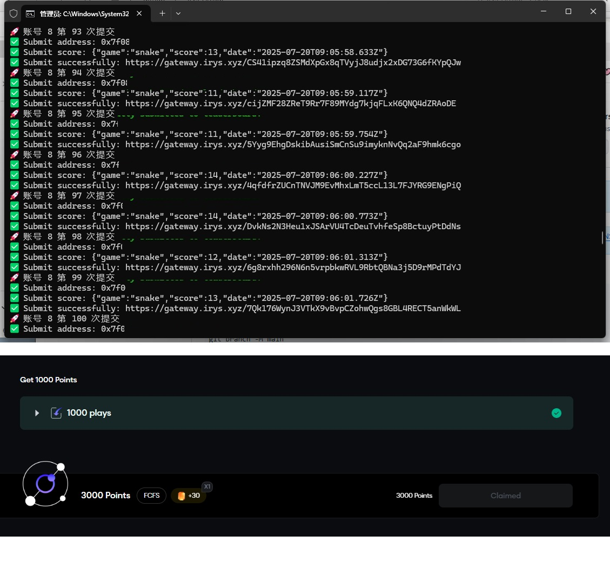

# Irys_Games_Bot 小游戏脚本

## 🚀简介  
#### 这是一个 **护肝型脚本**，用于自动完成 Irys 平台上的小游戏任务。

## 📝功能说明  
- 完成后可在**银河打卡**
- **自动随机**合理的游戏分数
- **支持所有**Irys小游戏(默认贪吃蛇)
- **无需Irys测试币**


## 🖥️ 系统支持
* Windows、macOS、Linux

## 📋 使用说明
1. 安装环境 [Node.js](https://nodejs.org/zh-cn/download)
 - 🪟 **Windows 用户**：请选择 `LTS -> Windows Installer (.msi) -> x64 / x86` 
 - 🍎 **macOS 用户**：请选择 `LTS -> macOS Installer -> Arm64 / x64` 
 - 🐧 **Linux 用户**：推荐使用 Node.js 官方提供的安装脚本

2. 打开终端（CMD / PowerShell / Terminal），进入项目目录：
```
   cd path/to/your/project
```
3. 运行脚本：
```
   node index.js
```


## 📦 文件结构

* `privateKeys.txt`：每行一个以太坊私钥
* `proxies.txt`：每行一个代理，支持以下格式（不支持SOCKS)：

```txt
http://ip:port
https://ip:port
http://username:password@ip:port
https://username:password@ip:port
```

## 🌌 运行截图  


## 🤝 贡献指南

欢迎提交 Issues 或 Pull Requests

---
---
#### ☕️ Coffee
- 🪪 Address: `0xE8Be55CA5Bdb6970F82bA508160C8D2688888888`  
- 🔗 Contact on  [X](https://x.com/CryptoPidan) ｜ [Telegram](https://t.me/CryptoPidan)
---
---
